# L'élément HTML CANVAS et l'API CANVAS

Voici les éléments abordés dans cette section : 

* Présentation de CANVAS

* Dessiner des rectangles 

* Définir des tracés pour dessiner des formes 

* Création de dégradés ou de motifs 

* Ajout d'ombre et de transparence

* Ajout de texte ou d'image

* Application de transformations

[Retour vers les chapitres JS](https://github.com/CalcagnoLoic/aide_memoire/blob/main/R%C3%A9pertoire/js.md)

# Présentation de CANVAS

CANVAS permet de réaliser des dessins au sein du HTML. L'API CANVAS sert essentiellement aux dessins en 2D alors que l'API WebGL se consacre aux dessins 3D. 

Pour avoir une zone de dessin, il suffit d'ajouter une balise canvas

```html
<!DOCTYPE hmtl>
<html>
    <body>
        <canvas id="c1" style="background-color:orange;"></canvas>
    </body>
</html>
```
<center>


</center>

Mais on peut également passer par le JS pour dessiner. Pour cela, il faut : 

* Accéder à l'élément canvas en JS

* Accéder au contexte de rendu du canvas

* Utiliser les propriétés et méthodes adaptées pour dessiner

```js
let canvas = document.getElementById('c1');
let ctx = canvas.getContext('2d');
```

# Dessiner des rectangles 

## Dessiner un rectangle vide 

Pour cela, on utilise la méthode `strokeRect()` qui prend en compte 4 arguments : 

`strokeRect(arg1, arg2, arg3, arg4)` où 

* arg1 = retrait du rectangle par rapport au bord gauche du canvas 

* arg2 = retrait du rectangle par rapport au bord supérieur du canvas 

* arg3 = largeur du rectangle

* arg4 = longueur du rectangle

De plus, on peut coloriser les bords du rectangle avec `strokeStyle`. **MAIS ATTENTION**, il faut mettre la couleur avant le dessin sinon la propriété ne s'appliquera pas sur la méthode! 

```js
let canvas = document.getElementById('c1');
let ctx = canvas.getContext('2d');

ctx.strokeStyle = '#4444CC'; //Nuance de bleu
ctx.strokeRect(50, 25, 200, 100);
```
<center>

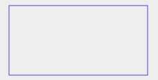

</center>

## Dessiner un rectangle plein

Au lieu d'utiliser une méthode et une propriété '`stroke`', on utilise '`fill`'. 

```js
let canvas = document.getElementById('c1');
let ctx = canvas.getContext('2d');

ctx.fillStyle = '#4444CC'; //Nuance de bleu
ctx.fillRect(50, 25, 200, 100);
```
<center>


</center>

# Définir des tracés pour dessiner des formes 

## Dessiner une ligne

On va utiliser différente méthode lors du dessin d'une ligne :

- `beginPath()` : pour initier le dessin

- `lineTo()` : elle prend en argument une paire de coordonnées qui indiquent le point final de la ligne

- `moveTo()` : permet de définir un point à partir duquel faire quelque chose

- `stroke()` : pour dessiner la ligne

- `strokeStyle` : coloriser la ligne

- `lineWidth` : épaisseur de la ligne

```js
let canvas = document.getElementById('c1');
let ctx = canvas.getContext('2d');

ctx.beginPath();
ctx.moveTo(50, 25);
ctx.lineTo(250, 125);
ctx.strokeStyle= '#4488EE'; //Nuance de bleu
ctx.lineWidth= 3;
ctx.stroke();
```
<center>

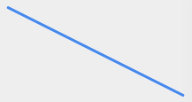

</center>

A noter que l'on peut également dessiner plusieurs lignes qui se rejoignent pour faire des formes. Mais dans ce cas, il ne faut pas oublier de fermer le tracé avec `closePath()`

```js
let canvas = document.getElementById('c1');
let ctx = canvas.getContext('2d');

ctx.beginPath();
ctx.moveTo(25, 25);
ctx.lineTo(25, 125);
ctx.lineTo(125, 125);
ctx.lineTo(25, 25);
ctx.strokeStyle = '#4488EE'; //Nuance de bleu
ctx.lineWidth = 3;
ctx.closePath();
ctx.stroke();

ctx.beginPath();
ctx.moveTo(275, 25);
ctx.lineTo(275, 125);
ctx.lineTo(175, 125);
ctx.lineTo(275, 25);
ctx.fillStyle = 'red'; 
ctx.fill();

ctx.beginPath();
ctx.moveTo(150, 25);
ctx.lineTo(150, 125);
ctx.strokeStyle = 'black';
ctx.lineWidth = 1;
ctx.closePath();
ctx.stroke();
```
<center>

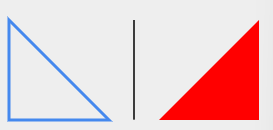

</center>

Mais on peut également dessiner plusieurs lignes avec des arrivées et des origines différentes! 

```js
let canvas = document.getElementById('c1');
let ctx = canvas.getContext('2d');

ctx.beginPath();
ctx.moveTo(50, 25);
ctx.lineTo(250, 25);
ctx.moveTo(275, 50);
ctx.lineTo(275, 100);
ctx.moveTo(250, 125);
ctx.lineTo(50, 125);
ctx.moveTo(25, 100);
ctx.lineTo(25, 50);
ctx.strokeStyle = 'black';
ctx.lineWidth = 1;
ctx.stroke();
```
<center>


</center>

## Dessiner des arcs de cercle

Pour dessiner des arcs de cercle, on utilise la méthode `arc()` qui prend 6 arguments :

`arc(arg1, arg2, arg3, arg4, arg5, arg6)` où 

* arg1 : décalage du point central de l'arc de cercle par rapport au bord gauche du canvas

* arg2 : décalage du point central de l'arc de cercle par rapport au bord supérieur du canvas

* arg3 : taille du rayon

* arg4 : l'angle de départ

* arg5 : l'angle de fin

* arg6 : un booléen indiquant si on dessine dans le sens horloger ou anti-horloger

```js
let canvas = document.getElementById('c1');
let ctx = canvas.getContext('2d');

//Arc de cercle vert
ctx.beginPath();
ctx.lineWidth = '5';
ctx.strokeStyle = '#4C8';
ctx.arc(50,50,35,0.8*Math.PI, 2*Math.PI);
ctx.closePath();
ctx.stroke();

//Cercle complet violet
ctx.beginPath();
ctx.lineWidth = '5';
ctx.fillStyle = '#A4A';
ctx.arc(150,85,40,0,2*Math.PI);
ctx.fill();

//Arc de cercle bleu
ctx.beginPath();
ctx.lineWidth = '5';
ctx.strokeStyle = '#48C';
ctx.arc(250,50,35,0.2*Math.PI, Math.PI, true);
ctx.closePath();
ctx.stroke();
```
<center>

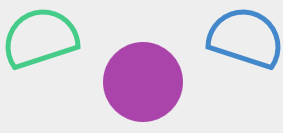

</center>

# Création de dégradés ou de motifs 

## Créer un dégradé linéaire 

Pour réaliser un dégradé linéaire, on utilise la méthode `createLinearGradient()` qui prend 4 arguments : 

`createLinearGradient(arg1, arg2, arg3, arg4)` où 

* arg1 : décalage entre le point de départ du dégradé et le bord gauche du canvas

* arg2 : décalage entre le point de départ du dégradé et le bord supérieur du canvas

* arg3 : écart entre le point de fin du dégradé et le bord gauche du canvas

* arg4 : écart entre le point de fin du dégradé et le bord supérieur du canvas

```js
let canvas = document.getElementById('c1');
let ctx = canvas.getContext('2d');

let lineaire = ctx.createLinearGradient(25, 25, 100, 25);
lineaire.addColorStop(0,'#4C8'); //Vert
lineaire.addColorStop(0.5, '#48C'); //Bleu
lineaire.addColorStop(1, '#A4A'); //Violet

ctx.fillStyle = lineaire;
ctx.fillRect(25, 25, 75, 100);

let lineaire2 = ctx.createLinearGradient(150, 25, 275, 125);
lineaire2.addColorStop(0,'#DD4'); //Jaune
lineaire2.addColorStop(1, '#D44'); //Rouge

ctx.beginPath();
ctx.moveTo(150, 25);
ctx.lineTo(150, 125);
ctx.lineTo(275, 125);
ctx.fillStyle = lineaire2;
ctx.fill();
```
<center>

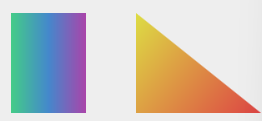

</center>

## Créer un dégradé radial

Pour réaliser un dégradé radial, on utilise la méthode `createRadialGradient()` qui prend 6 arguments : 

`createLinearGradient(arg1, arg2, arg3, arg4, arg5, arg6)` où 

* arg1 : écart entre le point de départ du dégradé et le bord gauche du canvas ;

* arg2 : écart entre le point (cercle) de départ du dégradé et le bord supérieur du canvas

* arg3 : rayon du point (cercle) de départ du dégradé

* arg4 : écart entre le cercle de fin du dégradé et le bord gauche du canvas

* arg5 : écart entre le cercle de fin du dégradé et le bord supérieur du canvas 

* arg6 : rayon du cercle de fin du dégradé

```js
let canvas = document.getElementById('c1');
let ctx = canvas.getContext('2d');

radial = ctx.createRadialGradient(150,75,10,150,75,50);
      
radial.addColorStop(0,'#DD4'); //Jaune
radial.addColorStop(1, '#D44'); //Rouge

ctx.beginPath();
ctx.fillStyle = radial;
ctx.arc(150,75,50,0,2*Math.PI);
ctx.fill();
```
<center>


</center>

# Ajout d'ombre et de transparence

## Gérer la transparence des dessins

Il s'agit d'utiliser tout simplement la propriété `globalAlpha` qui permet de rendre totalement transparent (0) ou totalement opaque (1). 

```js
let canvas = document.getElementById('c1');
let ctx = canvas.getContext('2d');

ctx.globalAlpha = 0.5;

ctx.fillStyle = 'rgb(255, 0, 0)';
ctx.fillRect(25, 25, 100, 100);

ctx.fillStyle = 'rgb(0, 0, 255)';
ctx.fillRect(175, 25, 100, 100);
```
<center>

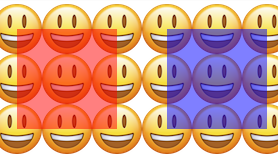

</center>

On pourrait également ajouter un argument à `fillStyle` en 4e argument sans passer par la propriété alpha. 

```js
let canvas = document.getElementById('c1');
let ctx = canvas.getContext('2d');

ctx.fillStyle = 'rgba(255, 0, 0, 0.5)';
ctx.fillRect(25, 25, 100, 100);

ctx.fillStyle = 'rgb(255, 0, 0)';
ctx.fillRect(175, 25, 100, 100);
```
<center>

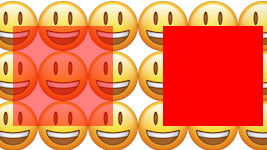

</center>

## Ajouter des ombres aux figures

Pour gérer les ombres, il existe 4 propriétés différentes : 

- `shadowOffsetX` : prend en valeur le décalage horizontal de l’ombre que l’on souhaite créer par rapport aux formes du canvas

- `shadowOffsetY` : prend en valeur le décalage vertical de l’ombre que l’on souhaite créer par rapport aux formes de notre canvas

- `shadowBlur` : permet de définir la dispersion de l’ombre

- `shadowColor` : permet d’indiquer la couleur de l’ombre

```js
let canvas = document.getElementById('c1');
let ctx = canvas.getContext('2d');

ctx.shadowColor = 'red';
ctx.shadowOffsetX = 5;
ctx.shadowOffsetY = 15;
ctx.shadowBlur = 10;

ctx.fillStyle = 'rgb(255, 0, 0)';
ctx.fillRect(25, 25, 100, 100);

ctx.fillStyle = 'rgba(255, 0, 0, 0.5)';
ctx.fillRect(175, 25, 100, 100);
```
<center>

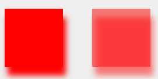

</center>

# Ajout de texte ou d'image

## Dessiner du texte

Pour dessiner un texte, on utilise les méthodes `strokeText()` et `fillText()` qui prend 3 arguents : le texte et la paire de coordonnées. Pour styliser le texte, il existe 4 propriétés : 

* `font` : elle utilise la même syntaxe que la propriété CSS

* `textAlign` : permet de gérer l'alignement du texte

* `textBaseline` : permet de définir l'aliglement de la ligne de base du texte

* `direction` : permet de définir la direction du texte

```js
let canvas = document.getElementById('c1');
let ctx = canvas.getContext('2d');


ctx.font = 'bold 20px Verdana, Arial, serif';

ctx.strokeStyle = '#48B';
ctx.strokeText('Texte creux', 25, 50);

ctx.font = 'bold 20px Verdana, Arial, serif';
ctx.fillStyle = '#48B';
ctx.textAlign = 'center'; //Le milieu du texte sera à 150
ctx.fillText('Texte plein', 150, 100);
```
<center>

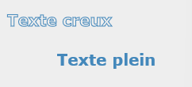

</center>

## Insérer une image

On va utiliser la méthode `drawImage()` qui prend 5 arguments mais dotn les 3 premiers sont obligatoires :

* La référence de l'image

* Une paire de coordonnées

* La largeur et la hauteur (facultatif)

```js
let canvas = document.getElementById('c1');
let ctx = canvas.getContext('2d');
let image = document.getElementById('sunset');

image.addEventListener('load', function(){
    ctx.drawImage(image, 75, 25, 150, 100);
}, false);
```

# Application de transformations

## Effectuer une translation du dessin

```js
let canvas = document.getElementById('c1');
let ctx = canvas.getContext('2d');

ctx.fillStyle = '#48A'; //Bleu
ctx.fillRect(25, 25, 75, 75);

//On déplace le point d'origine du canvas
ctx.translate(175, 25);


ctx.fillStyle = 'RGB(64,192,128)'; //Vert
ctx.fillRect(25, 25, 75, 75);
```
<center>

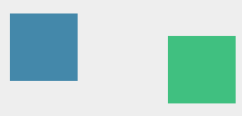

</center>

## Effectuer une rotation du dessin 

```js
let canvas = document.getElementById('c1');
let ctx = canvas.getContext('2d');

ctx.fillStyle = '#48A';
ctx.fillRect(0, 0, 300, 50);

//Première rotation de 20deg
ctx.rotate(Math.PI/9);
ctx.fillStyle = 'RGBa(64,192,128,0.6)'; //Vert
ctx.fillRect(0, 0, 300, 50);

//Deuxième rotation de 20deg. Les rotations se cumulent
ctx.rotate(Math.PI/9);
ctx.fillStyle = 'RGBa(192,64,192,0.6)'; //Rose
ctx.fillRect(0, 0, 300, 50);
```
<center>

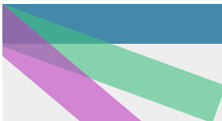

</center>

## Effectuer des transformations complexes

On utilse la méthode `transform` qui prend 6 arguments : 

* une mise à l'échelle dans le plan horizontal

* une torsion dans le plan horizontal

* une torsion dans le plan vertical

* une mise à l'échelle dans le plan vertical

* un déplacament horizontal 

* un déplacement vertical

```js
let canvas = document.getElementById('c1');
let ctx = canvas.getContext('2d');

ctx.transform(1, 0, 1, 1, 25, 50);

ctx.fillStyle = '#48B'; //Bleu
ctx.fillRect(0, 0, 75, 50);

ctx.fillStyle = '#4B8'; //Vert
ctx.fillRect(125, 0, 75, 50);
```
<center>


</center>

On peut annuler une transformation et en rédifinir une immédiatement via la méthode `setTransform()`

```js
let canvas = document.getElementById('c1');
let ctx = canvas.getContext('2d');

ctx.transform(1, 0, 1, 1, 100, 50);

ctx.fillStyle = '#48B'; //Bleu
ctx.fillRect(0, 0, 75, 50);

ctx.setTransform(1, 0, -1, 1, 100, 50);

ctx.fillStyle = '#4B8'; //Vert
ctx.fillRect(0, 0, 75, 50);
```
<center>


</center>

[Retour vers les chapitres JS](https://github.com/CalcagnoLoic/aide_memoire/blob/main/R%C3%A9pertoire/js.md)